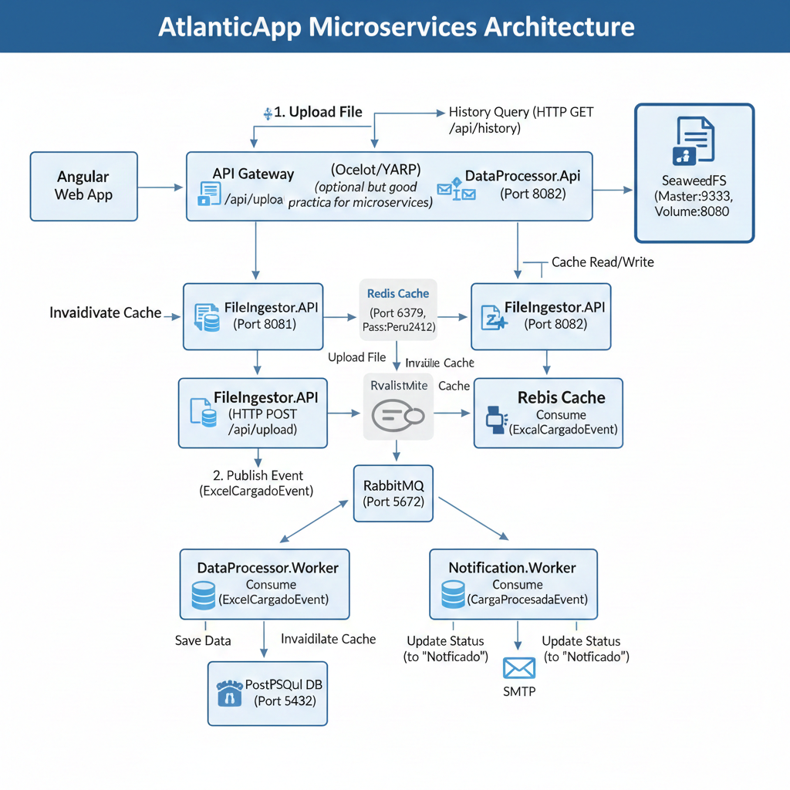

# AtlanticApp - Sistema de Ingesta Masiva y Procesamiento

Este repositorio contiene el ecosistema de microservicios para la carga, procesamiento y notificación de archivos Excel, optimizado con caché distribuida y almacenamiento de objetos.

## 🚀 Arquitectura del Proyecto

El sistema está compuesto por los siguientes servicios:
* **FileIngestor.API**: Puerta de entrada para la carga de archivos y gestión inicial.
* **DataProcessor.Worker**: Motor de procesamiento que transforma datos del Excel a la DB.
* **DataProcessor.Api**: Servicio optimizado para consultas rápidas de historial.
* **Notification.Worker**: Servicio encargado de la comunicación final con el usuario.
* **Infraestructura**: PostgreSQL (DB), Redis (Caché), RabbitMQ (Mensajería) y SeaweedFS (Storage).

---

## 🛠️ Tecnologías utilizadas
- **Framework:** .NET 8
- **Base de Datos:** PostgreSQL 15
- **Caché:** Redis (StackExchange.Redis)
- **Mensajería:** RabbitMQ (MassTransit / RabbitMQ.Client)
- **Almacenamiento:** SeaweedFS
- **Contenedores:** Docker & Docker Compose

---

## 📦 Requisitos previos
* [Docker Desktop](https://www.docker.com/products/docker-desktop/) instalado y en ejecución.
* Un archivo `.env` configurado en la raíz del proyecto.

---

## ⚙️ Configuración del Entorno (.env)
Crea un archivo `.env` basado en el siguiente ejemplo:
```env
# Base de Datos
DB_USER=myuser
DB_PASSWORD=mypassword
DB_NAME=mydatabase
POSTGRES_TAG=15-alpine

# Mensajería
RABBIT_USER=1234
RABBIT_PASS=1234

# Almacenamiento
SEAWEED_MASTER=seaweedfs-master:9333

Cómo levantar el proyecto
Para desplegar toda la infraestructura y los microservicios, ejecuta el siguiente comando en la raíz del proyecto:
docker-compose up -d --build

🔗 Puertos locales configurados:
FileIngestor API: http://localhost:8081

DataProcessor API: http://localhost:8082

RabbitMQ Management: http://localhost:15672 (guest/guest)

Redis: localhost:6379 (Password: Peru1234)

SeaweedFS Master: http://localhost:9333
⚡ Estrategia de Caché (Redis)
Se implementó un patrón Cache-Aside con invalidación proactiva:

Al consultar el historial, se busca primero en Redis.

Al subir un nuevo archivo, el FileIngestor.API invalida la caché.

Al finalizar el procesamiento, el DataProcessor.Worker vuelve a invalidar para asegurar datos frescos.

Para monitorear la caché en tiempo real:
docker exec -it redis_cache redis-cli -a Peru2412 MONITOR



